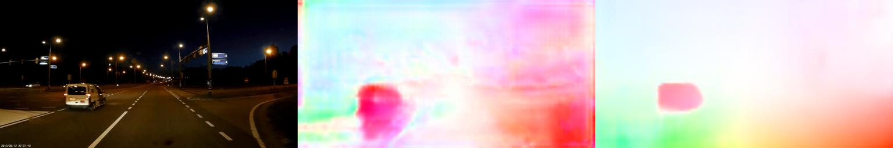
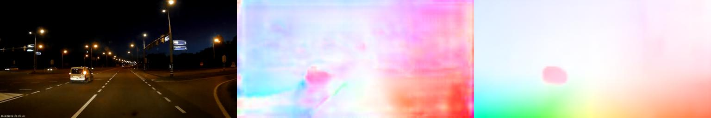
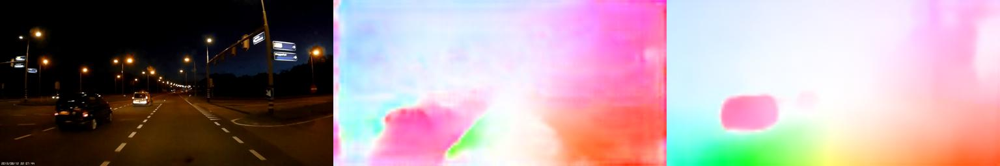
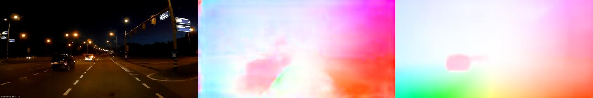
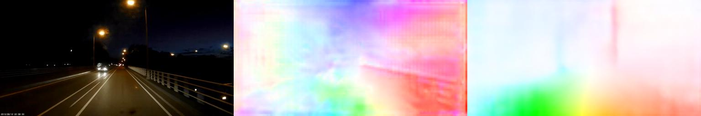
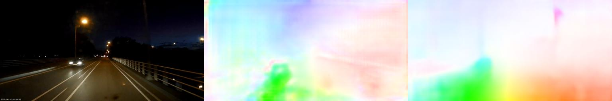
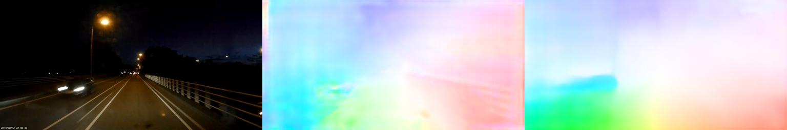

# Depth Estimation in Nighttime using Stereo-Consistent Cyclic Translations, arXiv'19 (for Optical Flow)
PyTorch code for the nighttime flow application of the [paper](https://arxiv.org/abs/1909.13701) - Depth Estimation in Nighttime using Stereo-Consistent Cyclic Translations, arXiv'19, Aashish Sharma, Robby T. Tan, and Loong-Fah Cheong. 

For original nighttime depth from stereo code, please refer [here](https://github.com/aasharma90/NighttimeDepthandFlow/tree/master/CycleStereoGAN_NighttimeDepth)

Please cite the paper if you find this code useful:
```
@article{sharma2019depth,
  title={Depth Estimation in Nighttime using Stereo-Consistent Cyclic Translations},
  author={Sharma, Aashish and Tan, Robby T and Cheong, Loong-Fah},
  journal={arXiv preprint arXiv:1909.13701},
  year={2019}
}
```
### Requirements
The code is tested on Python 3.7, PyTorch 1.1.0, TorchVision 0.3.0. 

During training, memory consumption per GPU (keeping a batch size of 4) was observed to be ~10Gb. 

### Training
For training, you can first try running the sample command below to sanitize your environment -
```
$  python train.py --name run1 \
                   --dataname Oxford \
                   --trn_datafile1 ./datafiles/sample_oxford_nighttime_01.txt \
                   --trn_datafile2 ./datafiles/sample_oxford_daytime_01.txt \
                   --val_datafile1 None \
                   --niter 20 \
                   --niter_decay 20 \
                   --batchSize 4 \
                   --loadSize '[320, 640]' \
                   --cropSize '[320, 640]' \
                   --loadmodel_flownet ./pretrained_ckpts/pwc_net.pth.tar \
                   --print_freq 1 \
                   --display_freq 1 \
                   --skip_validation
```
Note that, the sample training script above uses data meant only for illustration purposes. For actual trainiing and test data, please download the [The Oxford RobotCar](https://robotcar-dataset.robots.ox.ac.uk/datasets/) dataset, particularly nightime clips taken under varying illumination conditions (like 2014/11/14-night and 2014/12/10-night) and daytime clips taken under overcast conditions (like 2014/07/14-overcast). For our evaluation, we have used about 9000 randomly sampled images from the daytime data, and about 8900 randomly sampled images from the nighttime data for training. The code does not support validation at the moment, given that there are no flow ground-truths available from the Oxford dataset.

### Prediction
For sample testing, run for e.g. 
```
$ python predict.py --imglist ./datafiles/sample_nighttime_data1_01.txt --resultpath ./results/nighttime_data1/
```
Pre-trained checkpoints for the generators and flow networks (trained on the Oxford dataset) are provided for generating the flow results. The results directory will contain both the `.flo` and visualized flow results. 

### Sample Results
The results shown below in the following order: Image-1, Flow Result (PWCNet), and Flow Result (Proposed). 

Image: `./sample/nighttime_data1/0123.png`


Image: `./sample/nighttime_data1/0127.png`


Image: `./sample/nighttime_data1/0137.png`


Image: `./sample/nighttime_data1/0141.png`


Image: `./sample/nighttime_data2/0059.png`


Image: `./sample/nighttime_data2/0063.png`


Image: `./sample/nighttime_data2/0065.png`


### Acknowledgements 
Thanks to the authors of [PWCNet](https://github.com/NVlabs/PWC-Net/tree/master/PyTorch) and [ToDayGAN](https://github.com/AAnoosheh/ToDayGAN) for making their code public. 
