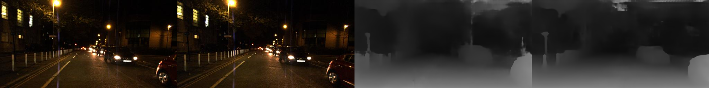

# Depth Estimation in Nighttime using Stereo-Consistent Cyclic Translations, arXiv'19
PyTorch code for the paper - Depth Estimation in Nighttime using Stereo-Consistent Cyclic Translations, arXiv'19, Aashish Sharma, Robby T. Tan, and Loong-Fah Cheong. 

Please cite the paper if you find this code useful:
```
@article{sharma2019depth,
  title={Depth Estimation in Nighttime using Stereo-Consistent Cyclic Translations},
  author={Sharma, Aashish and Tan, Robby T and Cheong, Loong-Fah},
  journal={arXiv preprint arXiv:1909.13701},
  year={2019}
}
```
### Requirements
The code is tested on Python 3.7, PyTorch 1.1.0, TorchVision 0.3.0. During training, memory consumption per GPU (keeping a batch size of 4) was observed to be ~10Gb. 

### Training
For training, you can first try running the sample command below to sanitize your environment -
```
$  python train.py --name run1 \
                   --dataname Oxford \
                   --trn_datafile1 ./datafiles/Oxford_NightTime_Sample.txt \
                   --trn_datafile2 ./datafiles/Oxford_DayTime_Sample.txt \
                   --val_datafile1 ./datafiles/Oxford_NightTime_Sample_withGT.txt \
                   --niter 20 \
                   --niter_decay 20 \
                   --batchSize 1 \
                   --loadSize '[256, 512]' \
                   --cropSize '[256, 512]' \
                   --maxdisp 48 \
                   --model_dispnet PSMNet_stackhourglass \
                   --loadmodel_dispnet ./pretrained_ckpts/netDisp1.tar \
                   --print_freq 1 \
                   --display_freq 1
```
Note that, the sample training script above uses data meant only for illustration purposes. For actual training/validation/test data, please download the [The Oxford RobotCar](https://robotcar-dataset.robots.ox.ac.uk/datasets/) dataset, particularly nightime clips taken under varying illumination conditions (like 2014/11/14-night and 2014/12/10-night) and daytime clips taken under overcast conditions (like 2014/07/14-overcast). In the paper, we have used about 9000 randomly sampled stereo pairs from the daytime data, and about 8900 randomly sampled stereo pairs from the nighttime data for training. An additional 1000 nighttime stereo pairs were used for validation, and about 250 more for testing. 

If you have any queries related to processing of the Oxford dataset (like for instance how to create the raw sparse disparity ground-truth), feel free to contact me at aashish<DOT>sharma<AT>u<DOT>nus<DOT>edu. 

### Prediction
To generate sample results on the Oxford RobotCar dataset, run for e.g. 
```
$ python predict.py --imgname 00701 --datapath ./sampledata/ --ckptpath ./pretrained_ckpts/
```
Pre-trained checkpoints for the generators and stereo networks are provided for generating the disparity results. 

### Sample Results
The results shown below are in the following order: Left Image, Right Image, Disaprity Result from PSMNet, and Disparity Result Proposed. 

Image: 00094 (Poorly-Lit Image)


Image: 00701 (Well-Lit Image)

  
### Acknowledgements 
Thanks to the authors of [PSMNet](https://github.com/JiaRenChang/PSMNet) and [ToDayGAN](https://github.com/AAnoosheh/ToDayGAN) for making their code public. 

Feel free to report any improvements or bugs present in the code. 
